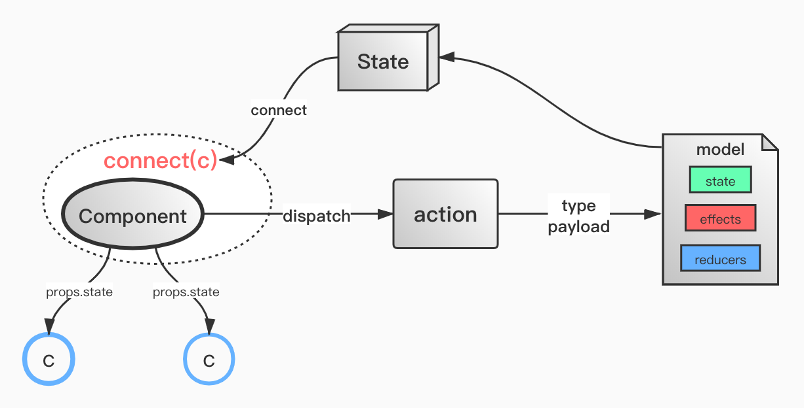

# 框架介绍
### 名称:
&ensp;&ensp; 前端PC端框架
***
### 简介:
&ensp;&ensp; 本项目运用前端技术为：html、css、less、javaScript、react、react-router、
redux、react-redux、redux-saga、axios、antd、js-base64、react-router-config
***
### 依赖:
+ 1、开发工具WebStorm或visual studio code
+ 2、打包依赖：webpack（^4.43.0）版本
+ 3、转义依赖：babel系列（^7版本）
+ 4、语法规范依赖：eslint（^7.3.1版本）
+ 5、开发框架依赖：react（^16.13.1版本）
***
### 相关命令:
1. 安装依赖:  
npm/cnpm install
2. 运行:  
npm run dev
3. 编译:  
npm run build  

编译后文件存在dist目录下
***
#框架说明
### 执行入口:
1. html入口  
src/index.html
2. js入口  
src/main.js
***
### 框架总体架构图:

***
### 模块划分
1. 容器组件(业务大的模块)  
务必在model文件夹下面建立自己的容器model，共享状态

2. 业务组件(基本业务模块)  
根据自己业务需求，定义该模块的状态

3. 容器组件的数据流转图

